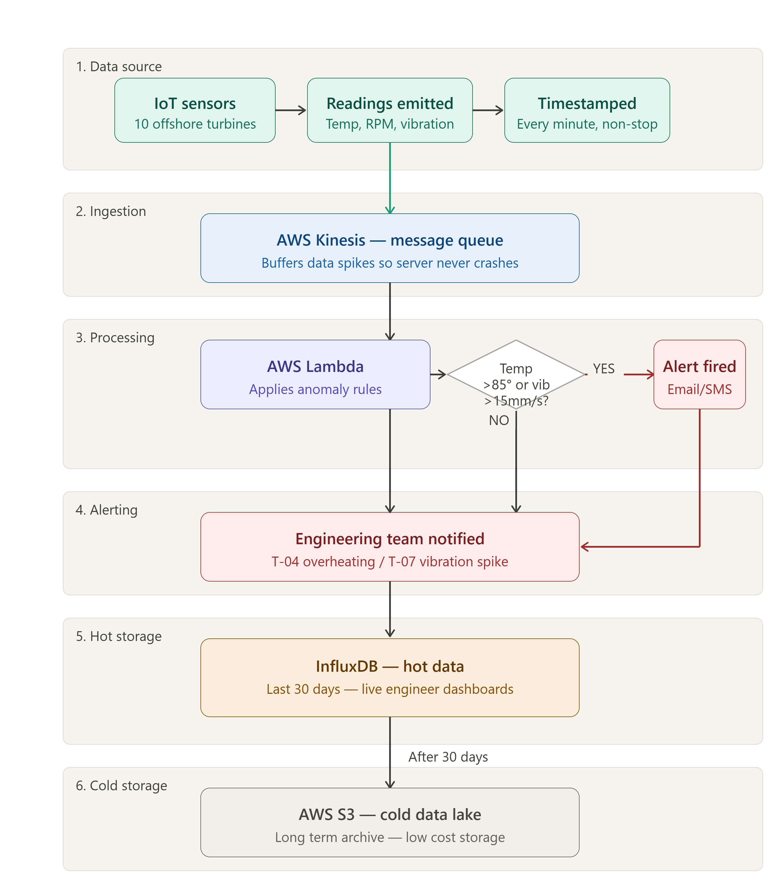

# AeroGrid Turbine Anomaly Detection

A Python script that reads wind turbine sensor data and flags any turbine breaching safe temperature or vibration limits. The repo also has a Dockerfile to run the script in a container, a proposed cloud architecture for handling the live data stream, and a short engineering report.

Completed as part of the Internship Experience UK (IEUK) virtual internship, delivered with Bright Network, 2026. [View certificate](./assets/IEUK_Technology_%26_Engineering_Internship_Certificate.png)

## The scenario

AeroGrid is a fictional offshore wind energy company from the internship brief. Its turbines have IoT sensors sending temperature, vibration and RPM readings. The legacy server struggles with the constant flow of data, and some turbines have failed because the warning signs were buried in the logs. The task was to find the failing turbines, containerise the analysis, propose a more scalable cloud design, and report back to the CTO.

## Results

| Turbine | Rule broken | Value | Limit |
|---|---|---|---|
| T-04 | Average temperature | 90.58°C | 85.0°C |
| T-07 | Maximum vibration | 25.0 mm/s | 15.0 mm/s |

The other eight turbines (T-01, T-02, T-03, T-05, T-06, T-08, T-09, T-10) stayed within both limits. The dataset is 5,000 readings from 10 turbines, with timestamps from 15 to 19 April 2026.

Every reading from T-04 was above 85°C and every reading from T-07 was above 15 mm/s, so both look like sustained faults rather than one-off glitches. The report suggests possible causes (a cooling or bearing fault for T-04, imbalance or blade damage for T-07), but the data alone can't confirm them.

The two thresholds were given in the brief, so my work was applying them to the data, not choosing them.

## How the script works

For each turbine, `analyse_turbines.py` calculates the average temperature and the highest vibration reading, then flags any turbine over either limit.

## Files

| File | What it is |
|---|---|
| `analyse_turbines.py` | The analysis script |
| `AeroGrid_Turbine_Analysis.ipynb` | The same analysis as a notebook (written in Google Colab) |
| `telemetry_data.csv` | The sensor data supplied with the brief |
| `Dockerfile` | Packages the script and data into a container |
| `AeroGrid_Engineering_Report.pdf` | Report to the CTO: findings, architecture reasoning, cost suggestion |
| `assets/` | Architecture diagram and internship certificate |

## How to run

Run from the folder containing both the script and `telemetry_data.csv`.

With Python:

```
pip install pandas
python analyse_turbines.py
```

With Docker:

```
docker build -t aerogrid-analysis .
docker run aerogrid-analysis
```

## Proposed architecture



1. **AWS Kinesis (message queue):** sensor readings go here first. It holds data during spikes so the processing layer is never overwhelmed, which addresses the crashing legacy server.
2. **AWS Lambda (stream processing):** applies the same anomaly rules as the data flows through, and sends an alert to engineers (email/SMS in the diagram) when a limit is breached.
3. **InfluxDB (hot storage):** a time-series database holding the last 30 days of data for live dashboards.
4. **AWS S3 (cold storage):** older data is archived here cheaply as a long-term data lake.

For cost, the report suggests S3 Intelligent-Tiering, which automatically moves data that hasn't been accessed for 30 days into cheaper storage tiers. AWS quotes savings of up to 40% for infrequently accessed data.

This is a design on paper (diagram plus written justification). I haven't built or deployed it on AWS. The brief pointed to the kinds of component to consider (message queue, stream processing, hot and cold storage), so the exercise was choosing specific services and explaining why.

## Limitations and next steps

- The script analyses a fixed CSV in one go. In the proposed design, the same rules would run on the live stream in Lambda.
- The vibration rule fires on a single reading. That works here because T-07 exceeded the limit on every reading, but a live system would probably need several consecutive readings to avoid false alarms from one bad sensor value.
- RPM is in the data but neither rule uses it. It would be worth checking whether it changes alongside temperature or vibration.
- I'd build a small version of the pipeline to test the architecture rather than leaving it as a diagram.
